#  **Estudio Hospitalización - Modelo de Machine Learning** 

## Modelo de Predicción de Hospitalización por Complicaciones Infecciosas Después de Biopsia Prostática

## *Objetivo del Proyecto:*

El objetivo del proyecto es identificar las características más relevantes de los pacientes que, tras someterse a una biopsia prostática, desarrollan complicaciones infecciosas que necesitan hospitalización en comparación con aquellos que no experimentan dichas complicaciones y, por lo tanto, no requieren hospitalización.

Para ello, se definió como "casos de hospitalización" a los pacientes que, después de someterse a una biopsia prostática, presentan fiebre, infección urinaria o sepsis en un plazo máximo de 30 días tras el procedimiento, lo que requiere atención médica ambulatoria u hospitalización para resolver la complicación. Por otro lado, se considera "control" a los pacientes que se sometieron a una biopsia prostática y no desarrollaron complicaciones infecciosas en el período de 30 días posterior al procedimiento.

El departamento de datos ha recopilado información como:
1. Antecedentes del paciente.
2. Morbilidad asociada al paciente.
3. Antecedentes relacionados con la toma de la biopsia.
4. Complicaciones infecciosas.

Estos datos se encuentran en el archivo BBDD_Hospitalizacion.xlsx y a continuación se puede observar el diccionario detallado correspondiente:

Lo que se busca es saber las características más importantes que tienen los pacientes de cierto tipo de enfermedad que terminan en hospitalización y crear un modelo predictivo de clasificación para la variable objetivo: **HOSPITALIZACION**.

### 1. Análisis exploratorio de datos

El análisis exploratorio de datos es una etapa crítica en cualquier proyecto de análisis de datos o investigación, ya que proporciona información valiosa para guiar las decisiones posteriores y asegurar la calidad de los resultados. Evitar esta etapa puede llevar a análisis sesgados, conclusiones incorrectas y una comprensión limitada de los datos subyacentes.

Todo este análisis detallado se puede encontrar en el Jupiter Notebook llamado Estudio_Hospitalizacion_EDA.ipynb. En resumen, los hallazgos encontrados a partir del EDA con sus respectivos cambios, son los siguientes:

| Cambio                 | Variables Afectadas      | Motivo                                     |
|--------------------------------|------------------------------------------------|---------------------------------------------------|
| Eliminación    | - DIAS HOSPITALIZACION MQ   - DIAS HOSPITALIZACIÓN UPC                    | Estas variables son una consecuencia de la variable objetivo **HOSPITALIZACION** por lo que no nos ayuda a predecir las causas de que un paciente sea hospitalizado después de realizarse una biopsia.                   |
| Imputación de Valores Atípicos   | - EDAD                     | Dos pacientes de 143 y 151 años. Estos registros fueron eliminados del dataset debido a que no tenemos con quién consultar si fue un error de digitación. No obstante, lo mejor es siempre corroborar la información con los responsables del negocio.                     |
| Reemplazo de Valores  | - DIABETES   - HOSPITALIZACION ULTIMO MES   - BIOPSIAS PREVIAS   - VOLUMEN PROSTATICO   - CUP   - ENF. CRONICA PULMONAR OBSTRUCTIVA   - FIEBRE   - ITU   - **HOSPITALIZACION**   | Las variables dicotómicas es decir, con valores de Si-No, las cambiamos a binarias (1-0, repectivamente) para poderlas gráficar más fácilmente. |
| Reemplazo de Valores         | - ANTIBIOTICO UTILIZADO EN LA PROFILAXIS   - BIOPSIA   | Las variables categóricas nominales fueron organizadas porque tenian categorías que se referían a lo mismo pero estaban escritas de forma diferente. |
| Eliminación   | - TIPO DE CULTIVO   - PATRON DE RESISTENCIA   - AGENTE AISLADO  | Se eliminan estas variables porque están muy relacionadas con una infección bacteriana que posiblemente cause la hospitalización. Esto fue revisado y efectivamente, estas variables solo tenían valores diferentes a "NO" en los casos de pacientes que resultaron en hospitalización. Por lo tanto, son variables redundantes. No nos brindan información sobre qué variables podrían causar esa infección bacteriana que finalmente resulta en hospitalización. |
| Eliminación  | - ENF. CRONICA PULMONAR OBSTTRUCTIVA   - HOSPITALIZACION ULTIMO MES   - CUP   - BIOPSIAS PREVIAS| Se eliminaron estas variables porque de los pocos pacientes que tenían datos en estos rubros, solo una pequeña parte (o ninguna) estaba incluida en los registros que terminaban en hospitalización. Por lo que no representan valor en nuestro análisis para buscar las variables que realmente pueden influir en que un paciente termine hospitalizado después de realizarse una biopsia. |
| Eliminación  | - ITU | Esta variable indica si se presentó una infección en el tracto urinario.  Solo se presentan casos para los que hubo infección bacteriana y que finalmente terminaron en hospitalización. Esta infección es algo que está muy ligado con nuestra variable objetivo, por lo que realmente no nos brinda información sobre sus causas que finalmente llevan a la hospitalización. |
| Eliminación | - FIEBRE | Esta variable está presente en 20 de los 23 casos de hospitalización, lo cual lo hace una variable redundante que va a llevarse toda la importancia si la dejamos en el modelo de Machine Learning. Sabemos que la fiebre es una consecuencia de una infección y no explica como tal las causas de que un paciente termine hospitalizado. |
| Eliminación | - BIOPSIA  | Para los 23 pacientes que fueron hospitalizados, la mayoría de datos son negativos, y los 4 registros diferentes a negativo son ADENOCARCINOMA GLEASON 6 y ADENOCARCINOMA GLEASON 7, los cuales, después de los negativos, son los más frecuentes en los pacientes que no presentaron hospitalización. Esto nos indica que esta variable no es la adecuada para realizar una correcta clasificación entre los casos tuvieron y no tuvieron hospitalización. |
| Eliminación | - ANTIBIOTICO UTILIZADO EN LA PROFILAXIS  | El antibiotico usado en la mayoría de casos de hospitalización es FLUOROQUINOLONA AMINOGLICÓSIDO, que es el más frecuente en los casos en los que no hubo hospitalización. Esto nos indica que es una variable que no nos va a aportar mucho valor en nuestro modelo predictivo de Machine Learning, porque no tiene buen poder de clasificación entre los casos positivos y negativos de hospitalización. |
| Eliminación | - NUMERO DE DIAS POST BIOPSIA EN QUE SE PRESENTA LA COMPLICACION INFECCIOSA  | Se encontró una fuerte correlación entre esta variable y nuestra variable objetivo **HOSPITALIZACION**. Esto tiene mucho sentido porque si se presentan días para que haya una complicación infecciosa, el paciente será hospitalizado. Es una variable redundante que no aporta valor a nuestro modelo de Machine Learning. |

De este modo, las variables con las que vamos a desarrollar los modelos de Machine Learning son:

- x0 = EDAD.
- x1 = DIABETES.
- x2 = PSA.
- x3 = VOLUMEN PROSTATICO.
- x4 = NUMERO DE MUESTRAS TOMADAS.
-  y = HOSPITALIZACION

### 2. Modelos de Machine Learning

Un modelo de machine learning (aprendizaje automático) sirve para realizar predicciones o tomar decisiones basadas en datos. Estos modelos son algoritmos matemáticos que aprenden de los datos y son capaces de generalizar patrones y relaciones a partir de ellos. Son herramientas versátiles que pueden aplicarse en una amplia variedad de campos y sectores para automatizar tareas y mejorar la toma de decisiones. Su capacidad para aprender y adaptarse a partir de datos los convierte en herramientas poderosas en la era de la inteligencia artificial. El detalle de todo el análisis de los modelos de Machine Learning se puede encontrar en el Jupiter Notebook llamado Estudio_Hospitalizacion_ML.ipynb

### *2.1. Balanceo de clases:*

En el análisis exploratorio de los datos (EDA), vimos que habían en total 433 datos, de los cuales 23 eran para la clase 1 de HOSPITALIZACION y 410 para la clase 0 de HOSPITALIZACION. Vemos que hay un desbalanceo muy grande de clases, por lo que al entrenar un modelo de Machine Learning con este desbalanceo, éste será muy bueno para clasificar un registro en la clase 0 pero muy malo para clasificar un registro en la clase 1. Por esta razón, vamos a tomar aleatoriamente 30 registros de la clase 0 y los 23 registros de la clase 1. De esta forma, el dataset queda más balanceado.

  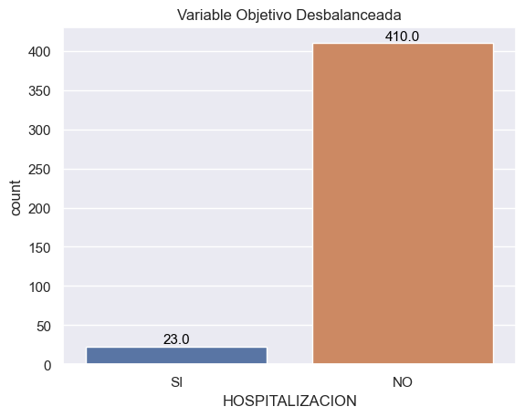
  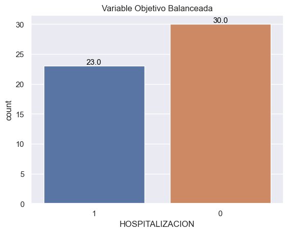

### *2.2. Modelo de árboles de decisión:*

Un modelo de árbol de decisión en Machine Learning es un algoritmo de aprendizaje supervisado que se utiliza principalmente para tareas de clasificación. Este modelo es una representación visual de un conjunto de reglas de decisión que se utilizan para tomar decisiones basadas en datos.

Para los modelos de Machine Learning se divide el dataset en dos conjuntos. Un conjunto de entrenamiento del modelo con el 80% y otro conjunto de testeo con el 20%. Esto se hace de forma aleatoria conservando un correcto balance entre las clases 0 y 1 de nuestra variable objetivo.

Un modelo de árbol de decisión necesita que definamos un hiperparámetro llamado "Profundidad del árbol". Esta profundidad define cuántos niveles de preguntas hará hasta que llegue a una hoja donde asigne una etiqueta definitiva. A continuación se puede observar un esquema de cómo funciona un modelo de árbol de decisión:  

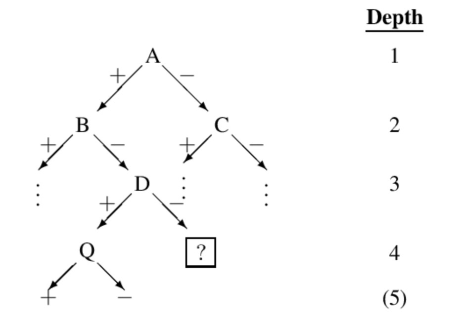

A, B, C, etc. representan las preguntas que va haciendo el árbol en cada subdivisión por sus ramas. En efecto, cada vez que baja un nivel, aumenta su profundidad.

Ahora bien, a priori no conocemos cuál es la profundidad óptima que nos maximiza la exactitud del modelo sin caer en un sobreajuste en el conjunto de entrenamiento (Exactitud =  1). Un sobreajuste en el conjunto de entrenamiento no permite que el modelo pueda generalizar y, por lo tanto, caer en este extremo no es correcto. A partir de la siguiente gráfica podemos buscar la profundidad óptima:

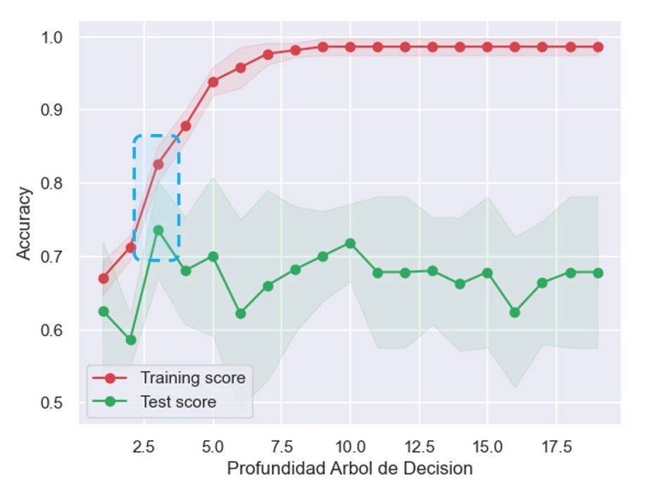

Se puede observar en el recuadro azul que la profundidad óptima es 3. Por lo que se procede a instanciar, entrenar y testear un árbol de decisión de profundidad 3 obteniendo el siguiente modelo:

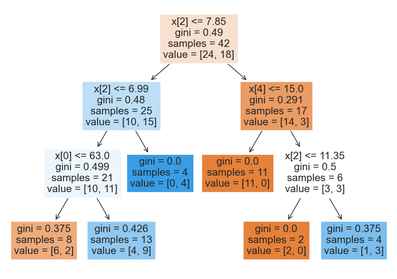

En el arbol de decisión vemos que inicia clasificando con la variable X[2], es decir, PSA. Si esta variable es menor o igual a 7.85, entonces 24 de los 42 registros no son hospitalizados y 18 si. Después baja al segundo nivel del árbol a revisar si la variable X[2][PSA] es menor o igual a 6.99 y por el otro lado, si a variable X[4][# MUESTRAS] es menor a 15. Y así sucesivamente hace clasificaciones. En general vemos que las variables con las que toma decisiones son X[2][PSA], X[4][# MUESTRAS] y X[0][EDAD]. A continuación, conoceremos los pesos de cada una de estas variables en el modelo de Machine Learning:

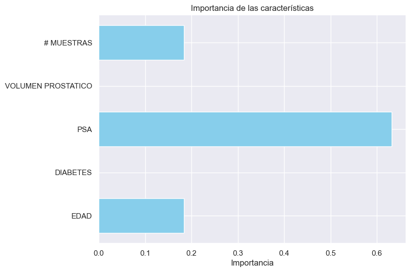

Del anterior gráfico se puede observar que la variable que tiene un mayor peso para definir si un paciente puede ser hospitalizado o no después de realizarse una biopsia, es la variable PSA (Concentración del PSA en la sangre), con un 63.2%. Le sigue el número de muestras tomadas con un 18.4% y por último la edad del paciente con un 18.4%. 

### *2.2.1. Evaluación del Modelo de Árboles de Decisión:*

Ahora bien, debemos revisar si estos resultados de clasificación arrojados por este modelo de árboles de decisión son confiables. Para eso creamos algo llamado Matriz de Confusión. 

**a. Matriz de Confusión:**

Una matriz de confusión es una herramienta fundamental en la evaluación de modelos de machine learning, especialmente en problemas de clasificación. Proporciona una forma de resumir el rendimiento de un modelo al comparar las predicciones del modelo con los valores reales conocidos en un conjunto de datos de prueba.

La matriz de confusión es una tabla que organiza las predicciones del modelo en cuatro categorías diferentes:

**Verdaderos Positivos (True Positives, TP):** Estos son los casos en los que el modelo predijo correctamente que una muestra pertenece a la clase positiva (la clase que estamos tratando de predecir).

**Verdaderos Negativos (True Negatives, TN):** Estos son los casos en los que el modelo predijo correctamente que una muestra no pertenece a la clase positiva.

**Falsos Positivos (False Positives, FP):** Estos son los casos en los que el modelo predijo incorrectamente que una muestra pertenece a la clase positiva cuando en realidad no lo hace. También se conocen como errores de Tipo I.

**Falsos Negativos (False Negatives, FN):** Estos son los casos en los que el modelo predijo incorrectamente que una muestra no pertenece a la clase positiva cuando en realidad sí lo hace. También se conocen como errores de Tipo II.

La matriz de confusión tiene la siguiente estructura:

|  | Predicción Negativa      | Predicción Positiva    |
|--------------------------------|------------------------------------------------|---------------------------------------------------|
| **Real Negativo** | 
 TN 
| 
 FP 
   |
| **Real Positivo** | 
 FN 
  | 
 TP 
 |

**Matriz de confusión para el conjunto de entreanamiento:**

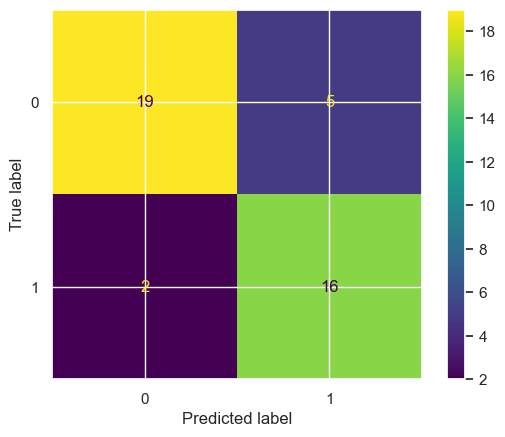

Se puede observar que para el conjunto de entrenamiento (42 registros) lo siguiente:
- Cantidad de verdaderos negativos: 19
- Cantidad de verdaderos positivos: 16
- Cantidad de falsos negativos: 2
- Cantidad de falsos positivos: 5

**Matriz de confusión para el conjunto de testeo:**

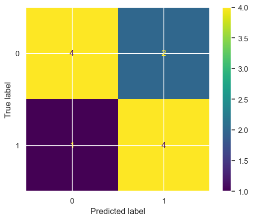

Se puede observar que para el conjunto de test (11 registros) lo siguiente:
- Cantidad de verdaderos negativos: 4
- Cantidad de verdaderos positivos: 4
- Cantidad de falsos negativos: 1
- Cantidad de falsos positivos: 2

A partir de estas matrices de confusión podemos obtener las sigueintes métricas:

**b. Exactitud:**

Mide la proporción de predicciones correctas en general. Se calcula como (TP + TN) / (TP + TN + FP + FN).

La exactitud del modelo de test es de **72.7%**, lo cual es una buena medida de ajuste e indica que el modelo tiene buena capacidad de predicción.

**c. Sensibilidad:**

Mide la proporción de casos positivos que fueron correctamente identificados por el modelo. Se calcula como TP / (TP + FN).

La sensibilidad es una medida que me indica cuantos verdaderos positivos (hospitalizados) tengo entre los verdaderos positivos y los falsos negativos (en realidad si van a estar hospitalizados pero el modelo arrojó que no). Esta métrica nos dio **80%**. Lo cual es muy bueno porque queremos que haya la menor cantidad de falsos negativos y poder predecir adecuadamente los pacientes que van para hospitalización.

**d. Curva AUC-ROC:**

La curva AUC-ROC (Área Bajo la Curva de Características Operativas del Receptor) es una herramienta comúnmente utilizada para evaluar y comparar el rendimiento de modelos de clasificación en machine learning. Esta curva proporciona una medida de la capacidad de discriminación de un modelo y su capacidad para distinguir entre clases positivas y negativas.

**Eje x (Tasa de Falsos Positivos, FPR):** En el eje horizontal, se representa la tasa de falsos positivos. Esto es la proporción de instancias negativas que el modelo clasifica incorrectamente como positivas. Se calcula como FPR = FP / (FP + TN), donde FP es el número de falsos positivos y TN es el número de verdaderos negativos.

**Eje y (Tasa de Verdaderos Positivos, TPR o Sensibilidad):** En el eje vertical, se representa la tasa de verdaderos positivos. Esto es la proporción de instancias positivas que el modelo clasifica correctamente como positivas. Se calcula como TPR = TP / (TP + FN), donde TP es el número de verdaderos positivos y FN es el número de falsos negativos.

**Curva ROC:** La curva ROC es una representación gráfica que muestra cómo varía la TPR (eje y) en función de la FPR (eje x) a medida que se cambia el umbral de clasificación del modelo. Cada punto en la curva ROC corresponde a un umbral de clasificación diferente.

**Área bajo la curva (AUC):** El AUC es un valor numérico que se calcula a partir de la curva ROC y mide la integral del área bajo la curva. El AUC proporciona una medida cuantitativa del rendimiento del modelo. Un AUC igual a 1 indica un modelo perfecto que puede distinguir perfectamente entre las clases, mientras que un AUC igual a 0.5 indica un rendimiento similar al azar.

A continuación se puede ver la curva ROC para la clase 0:

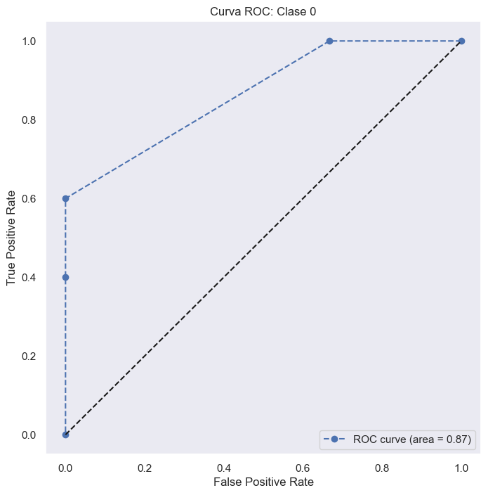

Se puede ver que el área bajo la curva calculado a partir de la gráfica de la clase 0 es de 0.87. No obstante, al hacer un cálculo del área bajo la curva de modo multiclase (usando las funciones de sklearn en Python), el modelo nos arroja un AUC-ROC de **0.73**, lo cual indica que el modelo tiene un buen rendimiento a la hora de clasificar entre las clases 0 y 1 de la variable **HOSPITALIZACION**.

### *2.3. Modelo de K-Vecinos:*

Un modelo de K-Vecinos, conocido como "K-Nearest Neighbors" o "K-NN", es un algoritmo de aprendizaje supervisado utilizado principalmente para problemas de clasificación. Es un método simple pero efectivo que se basa en la idea de que los puntos de datos similares tienden a estar en la misma clase o tener valores de salida similares.

La idea fundamental detrás del algoritmo K-NN es que, dado un punto de datos de prueba, el modelo busca los "K" puntos de datos más cercanos en el conjunto de entrenamiento (donde "K" es un número entero positivo especificado por el usuario). Luego, el modelo toma una decisión basada en la mayoría de las etiquetas de clase (en el caso de clasificación) o en la media de los valores de salida (en el caso de regresión) de esos puntos vecinos.

En el caso de esta imagen, si por ejemplo el usuario selecciona un K de 3, entonces la estrella roja será clasificada como un círculo morado porque son los de mayoría. 

Debido a que es un método basado en distancias, fue necesario hacer una normalización de toda las variables usando el método MinMaxScaler. Con esto, todas las variables quedan entre 0 y 1.

Como en el modelo de árboles de decisión, vamos a iniciar buscando el valor de K que nos maximiza la exactitud del modelo. Los resultados se pueden apreciar en la siguiente gráfica:

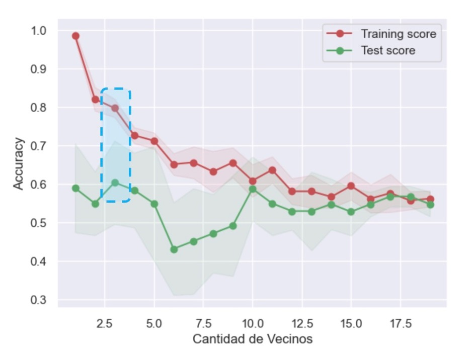

Vemos que el valor óptimo de K es de 3 sin que se presente un sobreajuste del modelo de entrenamiento. Vamos a instanciar, ajustar y testear un nuevo modelo pero con este valor de K y calculamos las métricas de evaluación que usamos para el modelo de árboles de decisión.

### *2.3.1. Evaluación del Modelo de K-Vecinos:*

**Matriz de confusión para el conjunto de entreanamiento:**

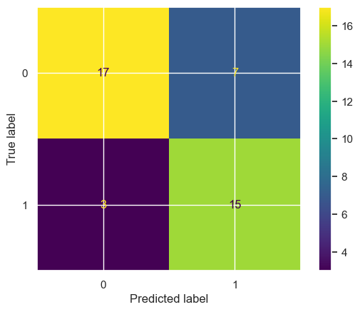

Se puede observar que para el conjunto de entrenamiento (42 registros) lo siguiente:
- Cantidad de verdaderos negativos: 17
- Cantidad de verdaderos positivos: 15
- Cantidad de falsos negativos: 3
- Cantidad de falsos positivos: 7

**Matriz de confusión para el conjunto de testeo:**

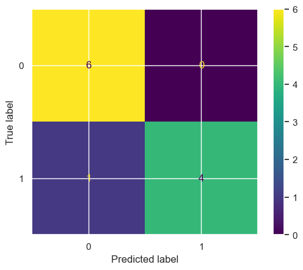

Se puede observar que para el conjunto de test (11 registros) lo siguiente:
- Cantidad de verdaderos negativos: 6
- Cantidad de verdaderos positivos: 4
- Cantidad de falsos negativos: 1
- Cantidad de falsos positivos: 0

A partir de estas matrices de confusión podemos obtener las sigueintes métricas:

**b. Exactitud:**

La exactitud del modelo de test es de **90.9%**, lo cual es una muy buena medida de ajuste e indica que el modelo tiene buena capacidad de predicción.

**c. Sensibilidad:**

La sensibilidad es una medida que me indica cuantos verdaderos positivos (hospitalizados) tengo entre los verdaderos positivos y los falsos negativos (en realidad si van a estar hospitalizados pero el modelo arrojó que no). Esta métrica es del **80%**. Lo cual es muy bueno porque queremos que haya la menor cantidad de falsos negativos y poder predecir adecuadamente los pacientes que van para hospitalización.

**d. Curva AUC-ROC:**

A continuación se puede ver la curva ROC para la clase 0:

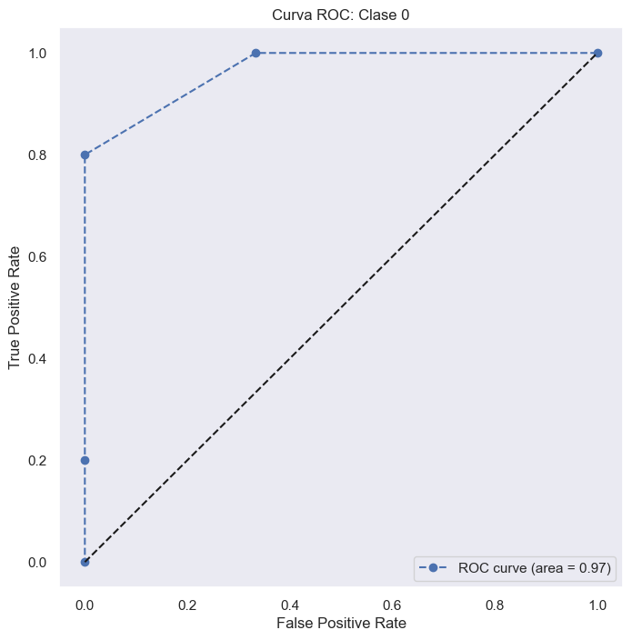

Se puede ver que el área bajo la curva calculado a partir de la gráfica de la clase 0 es de 0.97. No obstante, al hacer un cálculo del área bajo la curva de modo multiclase (usando las funciones de sklearn en Python), el modelo nos arroja un AUC-ROC de **0.90**, lo cual indica que el modelo tiene un buen rendimiento a la hora de clasificar entre las clases 0 y 1 de la variable **HOSPITALIZACION**.

### 3. Conclusiones:

En este proyecto de análisis y modelado de Machine Learning para predecir la hospitalización por complicaciones infecciosas después de una biopsia prostática, hemos realizado un proceso completo que incluye desde la preparación y exploración de datos hasta la construcción y evaluación de modelos. Las conclusiones que podemos extraer de todo este proceso son las siguientes:

- **Selección de Características Relevantes:** Después de un exhaustivo análisis exploratorio de datos (EDA), identificamos las características más relevantes para predecir la hospitalización. Estas características incluyen la edad del paciente, la concentración del PSA en la sangre (PSA), el número de muestras tomadas (# MUESTRAS), la presencia de diabetes y el volumen prostático.

- **Balanceo de Clases:** Dado que teníamos un desequilibrio significativo entre las clases de hospitalización y no hospitalización, aplicamos un método de submuestreo aleatorio para equilibrar el conjunto de datos de entrenamiento. Esto mejoró la capacidad del modelo para clasificar ambas clases de manera efectiva.

- **Modelo de Árboles de Decisión:** Construimos un modelo de árboles de decisión para predecir la hospitalización. Después de optimizar la profundidad del árbol a 3, obtuvimos un modelo con un rendimiento bueno. Los valores de las tres métricas de evaluación y comparación son los siguientes:

    - Exactitud: 72.7%
    - Sensibilidad: 80%
    - Curva AUC-ROC: 0.73

     Las variables más importantes para este modelo fueron PSA (63.2%), # MUESTRAS (18.4%) y la edad del paciente (18.4%).

- **Modelo de K-Vecinos (K-NN):** También implementamos un modelo de K-Vecinos con el valor óptimo de K igual a 3. Este modelo mostró un rendimiento aún mejor que el modelo de árboles de decisión, con las siguientes métricas de evaluación y comparación:

    - Exactitud: 90.9%%
    - Sensibilidad: 80%
    - Curva AUC-ROC: 0.90

 

- **Evaluación de Modelos:** Utilizamos métricas como la exactitud, la sensibilidad y la curva AUC-ROC para evaluar el rendimiento de los modelos. Ambos modelos obtuvieron resultados sólidos, con el modelo K-NN destacando en términos de exactitud y capacidad de identificar pacientes hospitalizados.

### 4. Recomendaciones:

- **Recopilación de Datos Adicionales:** Para mejorar aún más el rendimiento de los modelos, se recomienda recopilar datos adicionales que puedan ser relevantes para la predicción de hospitalización. Esto podría incluir información sobre la salud general del paciente, el historial médico y más detalles sobre las complicaciones infecciosas. Por otro lado, aunque muchas variables fueron eliminadas durante el análisis exploratorio de datos, esto no quiere decir que esta información no es relevante para futuros estudios. Se recomienda más exahustividad para tratar de llenar todos los campos que correspondan, con el objetivo de obtener conclusiones mucho más acertadas.

- **Validación Externa:** Los modelos deben ser validados con datos externos si están disponibles. Esto ayudaría a determinar si los modelos son generalizables más allá del conjunto de datos actual y si pueden ser utilizados en situaciones clínicas reales.

- **Actualización Continua:** Los modelos de Machine Learning deben ser actualizados periódicamente con nuevos datos a medida que estén disponibles. Esto garantiza que los modelos sigan siendo precisos a medida que cambian las condiciones y los tratamientos médicos.

- **Colaboración Interdisciplinaria:** Dado que este proyecto está relacionado con el campo médico, se recomienda una estrecha colaboración con profesionales de la salud y expertos en urología para validar las predicciones y asegurar que sean clínicamente relevantes.

- **Interpretación Clínica:** Los resultados de los modelos deben ser interpretados por profesionales de la salud antes de tomar decisiones clínicas importantes. Los modelos son herramientas de apoyo, pero no deben reemplazar el juicio médico.

Finalmente, este proyecto ha demostrado la viabilidad de utilizar el Machine Learning para predecir la hospitalización después de una biopsia prostática. Los modelos construidos pueden ser valiosos para ayudar a identificar a los pacientes en mayor riesgo y tomar decisiones médicas informadas. Sin embargo, se deben seguir las recomendaciones mencionadas anteriormente con el objetivo de mejorar la calidad y la utilidad de los modelos en entornos clínicos reales.
